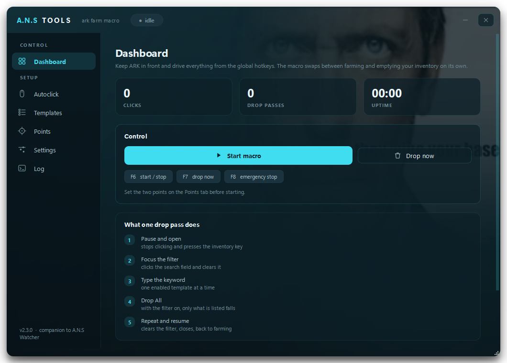
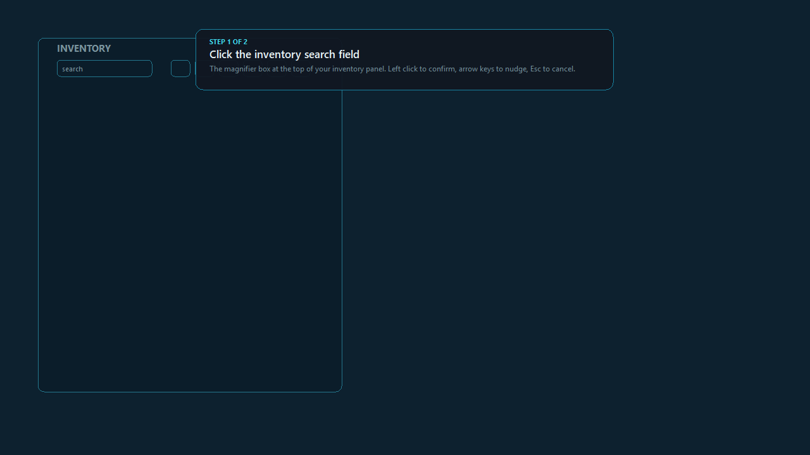
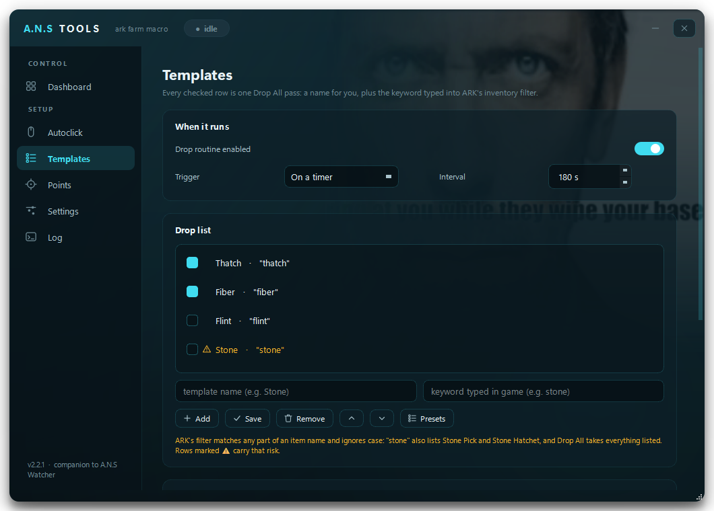

# A.N.S Tools

Autoclicker with an automatic inventory-cleanup routine for ARK: Survival
Ascended. It farms on its own and, every so often, opens the inventory, filters
the junk by keyword and drops it — then goes right back to swinging.

Shares its visual language with **A.N.S Watcher**: petrol-to-black canvas, cyan
glows, glass cards, and the tribe brand melting out of the backdrop.



Swap the backdrop by dropping your own `brand.png` (or `.gif`, `.jpg`) into
`assets/`. No file, no problem — the gradient stands on its own.

> **New here?** [**GUIDE.md**](GUIDE.md) walks the whole thing from the first
> click to a farming session. This file is the reference behind it: what each
> piece does and why it works that way.

## Install

**Double-click `Start.bat`.** That is the whole install.

Nothing has to be on the machine first — no Python, no terminal, no
administrator rights. The first run finds a Python if there is one, and installs
a private copy into the app folder if there is not, puts the packages next to it
in `.venv`, and opens the app. Later runs skip all of that and just start.

Everything it downloads lives **inside the app folder**. Nothing is added to
`PATH`, nothing is installed for all users, and deleting the folder removes every
trace of it.

<details>
<summary>What if it does not work</summary>

Run this in the app folder and read what it says — it changes nothing:

```
powershell -ExecutionPolicy Bypass -File tools\setup.ps1 -CheckOnly
```

It reports the Python it found, whether the packages are installed, and whether
`git` is present. The last one matters: **in-app updates need `git`**, and a copy
downloaded as a ZIP instead of cloned has no repository to pull into. The Updates
card says so when that is the case.

</details>

<details>
<summary>Running it from a terminal instead</summary>

Windows, Python 3.10+.

```bash
pip install -r requirements.txt
python main.py
```

</details>

## Setting the two points

The routine only needs two clicks, but they depend on your resolution and on
what the HUD is showing. Instead of a countdown, the macro **freezes the
screen** and lets you pick them with a magnifier:



1. Open the inventory in ARK — *exactly* the state the macro will use
   (inventory alone with `I`, or with a storage box open; the icon row sits in
   a different place in each).
2. Press `F9`. The window hides, the screen is captured and the overlay comes
   up.
3. Click the **search field**, then the **Drop All** button — the second icon
   of the row, right next to the crossed arrows that mean *transfer all*.
   Arrow keys nudge one pixel, `Shift`+arrow ten, `Enter` confirms, `Esc`
   cancels.
4. Each captured point keeps a zoomed thumbnail of what you targeted, and
   **Test** moves the cursor there without clicking so you can double-check.

Run the game in **borderless or windowed** mode — exclusive fullscreen cannot
be captured or overlaid.

No screenshot possible? **Estimate points for this resolution** computes a
starting guess. ARK anchors its HUD to the centre of the screen and scales it
with height, so the maths also holds on ultrawide: at 1920x1080 it gives filter
`(277, 193)` and Drop All `(457, 193)`. If you later change resolution, the
saved points are rescaled automatically on the next start.

## Updating

**Settings → Updates → Check for updates → Update and restart.** The app
fast-forwards its own clone (`git pull --ff-only`) and relaunches itself, so
whatever we push here lands on your machine with one click.

- `config.json`, `state/` and `captures/` are gitignored — an update never
  touches your settings, captured points or dry-run screenshots.
- It refuses to pull over uncommitted changes instead of stashing them. Commit
  or discard first.
- If `requirements.txt` changed, the card says so, and the restart goes through
  `Start.bat` — which installs the new packages before the app comes back. It is
  still not pulled unattended: a failed install should not be discovered by the
  app never reappearing.
- It checks once on startup (toggle in the same card). When something is
  waiting, an *update available* pill appears in the title bar.
- Rolling back is plain git: `git reset --hard <sha>`, or `git reflog` to find
  where you were.

### Zero clicks: Update on its own

Same card, second switch. With it on the app checks at startup **and every 20
minutes**, then pulls and restarts without asking — a commit pushed here reaches
the running app with nothing for you to do.

What that buys and what it costs, plainly:

- There is **no review gate**. Whatever is pushed is what you farm with, on the
  next check. That is the point of the switch, and the whole risk of it.
- It **never restarts mid-farm.** An update that lands while the macro is
  running is held, with a line in the log, and applied the moment you stop.
- A **dirty checkout is skipped** entirely — the pull would refuse anyway.
- A pull that **fails** (a diverged branch, no network) stands down for the rest
  of the session instead of retrying every 20 minutes. Fix the reason and use
  the button once; the next start re-arms it.
- The clone follows **whatever branch it is on**. On `main` it tracks `main`;
  check out a feature branch and it tracks that instead. Worth knowing if the
  card ever says "you are on the latest commit" while you expect something new
  — check which branch the card names.

## The Farm page

One macro, one page. Swinging, when it stops to empty the bag, what to drop, the
two points it clicks, and the feeding that keeps you alive while it runs — all in
the order you would set them up. It used to be three separate tabs, which meant
configuring one macro by walking a menu.

The drop cycle is built from **checkable templates** — a friendly name plus the
keyword that gets typed into the filter:



- **Add** creates one from the two fields; **Save** applies edits to the
  selected row.
- Only checked rows run, in list order (`↑` `↓` to reorder).
- **Presets…** opens a library of ARK resources grouped by what you are
  farming.

## Display scaling

Every coordinate the app stores — the two farm points, both picked areas — is a
**physical screen pixel**, and so is every cursor move and pixel read it makes.
Windows reports those directly only to a **DPI-aware** process, so the app claims
per-monitor awareness on startup rather than inheriting it from the toolkit.

This matters because **laptops are almost never at 100%**. Windows recommends
125% or 150% for a high-resolution laptop panel, and at that setting the window
toolkit's coordinates and the screen's real pixels are different numbers for the
same place. Mixing them is invisible on a desktop at 100% and puts a picked area
a third off on a laptop.

**Settings → Check this display** measures your machine and writes the answer
to the Log. Run it once on a new PC:

```
--- display check ---
DPI awareness: per-monitor v2
primary screen reports 1920x1080 px
screen 1 (primary): 1280x720 logical at (0, 0), 1.5x scaling → 1920x1080 physical
cursor at (742, 511) round-trips through 1.5x scaling to (742, 511) — picked areas will land where you drag them
--- display check done ---
```

It takes a real coordinate from Windows, pushes it through the exact conversion
the area picker uses, and checks it comes back unchanged. If it does not, it says
so in red rather than passing quietly — a check that always passes would be worse
than none.

Every time a picker opens, the log also records what it is working against:

```
21:04:12 picking on a 1280x720 screen at 1.5x scaling — 1920x1080 px captured, desktop reports 1920x1080
```

If a selection ever lands somewhere you did not drag, that line is the first
thing to read, and the app calls it out itself when the capture and the screen
disagree.

## How ARK's filter works — read this before arming

The inventory search is a case-insensitive **"contains" match on the item's
display name**, and **Drop All acts on whatever the filter left on screen**.
That is exactly what the routine exploits ([official discussion][filter]:
*"you can type 'meat' into the search and press Drop All, and only the meat
will be dropped"*).

The dangerous consequence: a short keyword also catches your gear.

| Keyword | Also lists | Risk |
|---|---|---|
| `stone` | Stone Pick, Stone Hatchet | **high** — drops your tools |
| `metal` | Metal Pick, Metal Hatchet, metal armor and structures, Metal Ingot | **high** — and no substring catches the ore alone |
| `wood` | Wooden Club, wooden structures | **high** |
| `hide` | Hide Shirt, Hide Pants (armor) | **high** |
| `berry` | Mejoberry, Narcoberry | **high** — loses kibble and narcotics |
| `thatch`, `fiber`, `flint`, `keratin`, `chitin`, `pelt` | — | ok |
| `raw meat` | does *not* match Raw Prime Meat | ok |

Ways around it:

- Farming stone? Carry **metal tools** — then `stone` is safe. The reverse does
  not work: `metal` matches the metal tools you just switched to, so empty the
  bag of metal gear before arming that one.
- Want only the dye berries? Use `amarberry`, `azulberry` and `tintoberry`
  instead of `berry`, so Mejoberry and Narcoberry stay in your bag.
- **Do a dry run first.**

### The inverse filter

A "contains" match cuts both ways, and the sharpest keywords are sometimes the
shortest. Farming metal, the thing you want is a two-item list — **Metal** and
**Element Shard** — and neither name contains the letter `o`. So a template with
the single keyword `o` lists Stone, Wood, Obsidian, Cooked Meat, Hide Boots and
essentially everything else you picked up by accident, and Drop All clears it in
one pass. Your Metal Pick and Metal Hatchet survive for the same reason.

Instead of naming what to throw away, you name a letter the keepers do not have.
It is the most destructive template you can write and, aimed properly, the most
useful. The app flags it and runs it. **Dry-run it once** on a full bag before
trusting it — the screenshot shows you the exact list that would have fallen.

One known gotcha: when the game's language and the system's disagree, the
search and the bulk action can work on different strings and Drop All does
nothing ([report][language]). Write the keywords in the language the game is
running in.

## Dry run

Runs the whole cycle — opens the inventory, clicks the magnifier, types the
keyword — but **never clicks Drop All**. It saves a screenshot of the filtered
inventory to `captures/` instead, so you can confirm that `stone` is not
listing your pick before letting the macro loose.

## Global hotkeys

| Key | Action |
|-----|--------|
| `F6` | start / stop the macro |
| `F7` | run a drop pass now |
| `F8` | emergency stop |
| `F9` | freeze the screen and pick the points |

All rebindable on the **Settings** page, and all listed on the **Dashboard** —
including the two that belong to the Drop and Overcap skin macros, which the
dashboard also names so "what does F3 do" never needs a hunt.

The four above are the app's own: they are registered as global hotkeys, so they
fire anywhere and **ARK never sees them**. The two macro keys are the opposite —
they are only watched, never swallowed, because the game has to receive them.

## One drop pass, step by step

Fired on a click count (**14 clicks and at least 20 s of farming** by default),
on a timer, or by `F7`:

1. pause the autoclick and press the inventory key (`I` by default);
2. **wait for the panel to actually be on screen** — not for a fixed number of
   milliseconds, but until the pixels say it is up and has stopped moving;
3. click the filter field;
4. type the template's keyword;
5. **read the search box** — no keyword visibly in there, no drop;
6. click **Drop All**, after one last look that the panel is still there;
7. repeat for every checked template, in list order;
8. press **`Esc` twice** to close the inventory and resume farming. Nothing
   clears the filter by hand: ARK empties the search box itself when Drop All
   fires.

## The one failure that costs the whole bag

Steps 3 and 5 used to be joined by nothing but a half-second wait, and that is a
hope, not a check. If the click missed the search field, or the window lost
focus for a frame, or the stream swallowed the burst of keys, the box stays
**empty** — and **Drop All with no filter empties the entire inventory**, tools
and all. It is the one failure of this routine that cannot be walked back.

So the box is read instead of trusted. Right after the field is focused, while
it is certainly empty, the macro samples a band of pixels across it; after
typing it samples them again:

```
23:15:44 filtering "flint"
23:15:45 clicked Drop All at (1400, 900)
23:15:47 filtering "thatch"
23:15:48 "thatch" never reached the search field — Drop All skipped, the bag keeps this one
```

### Why it counts ink and not changes

The obvious measure — *did these pixels change* — has a wrong answer that costs
the bag, and it is the wrong answer in exactly the case the check exists for.

A fixed wait after the inventory key is a guess. Under lag the panel is still
coming up when it expires, so the filter click lands in the game world and the
keyword goes nowhere. By the time the box is read the second time the panel
**has** arrived — so the band went from the moving game world to flat inventory
chrome, every sample moved, and a check counting moved samples reports the
keyword landed at the precise moment the filter is empty. The lag does not defeat
the check; it *recruits* it.

So the measure is **ink**: how many samples sit away from the flattest colour in
that same reading. The background is taken from the reading being judged, which
makes it blind to anything that moves the whole band at once. The game world is
busy and full of ink; an empty search box is flat and has almost none; a typed
word puts a word's worth back. A panel arriving late makes ink *fall*, and the
drop is refused.

The check for the panel itself is the other half, and it comes first: nothing is
typed until the strip between the two captured points stops looking like the
world and holds still for two readings. There is one more look right before the
Drop All click, because that is the click that cannot be walked back.

The mouse sits on the filter point for every reading, so whatever the cursor
covers is covered identically each time and carries no information either way.

What it does **not** do is read *which* text is in there: `met` and `metal` both
look like "not empty". A keyword that got in halfway still passes, and ARK's
filter is a "contains" match, so the two rules on the Farm page still hold —
long, unambiguous keywords, and nothing in the bag you cannot afford to lose.

The switch is **Farm → Before every Drop All**. Turning it off does not
skip the check, it only stops it from blocking: the drop goes out anyway and the
log says the box looked empty, which is the honest way to measure how often it
trips on your connection. **It needs a readable screen.** In exclusive fullscreen Windows hands back no
pixels at all, so the check cannot run — and when it cannot run, **the drop is
held back** rather than sent unverified. A check that quietly degrades into no
check, on the one failure that cannot be undone, is worse than none. Run ARK
**borderless or windowed** and it never comes up.

### Very short keywords are flagged, not blocked

ARK matches any part of an item name, so `o` lists Stone, Wood, Cooked Meat,
Hide Boots and most of a bag, and Drop All takes the lot. That is a typo about
as often as it is the point — see [the inverse filter](#the-inverse-filter)
below. The app cannot tell the two apart and does not try: a one- or two-letter
keyword is marked amber in the template list, logged when you add it, and then
run exactly as typed. Dry-run a new one once and the screenshot settles it.

Two presses, not one, and that is the whole trick: typing in the filter leaves
the **search field holding the keyboard**, so the first `Esc` only steps out of
the field and the second is what actually closes the panel. With a single press
the inventory stayed open and the macro kept clicking inside it — swings that
never landed on a node, and a next pass that pressed `I` into an already open
panel.

But a fixed count is the wrong tool, in both directions: one press too few and
the macro farms inside an open inventory, one too many and the spare `Esc`
reaches the game and opens the pause menu. So the macro **does not count — it
looks**. Right before closing, while the panel is certainly up, it reads five
pixels along the line from the filter field to Drop All (the panel's icon row),
then presses and re-reads until those pixels change:

```
23:15:50 closing the inventory
23:15:51 inventory still up after 1x esc — pressing again
23:15:51 inventory closed after 2x esc
```

If four presses go by with the panel still there, it tries the other key once
(the inventory key when you close with `Esc`, and the reverse) and says so in
the log. **Presses to close** (1–5, under *Farm → Inventory and timings*)
is the fallback for when the screen cannot be read — background delivery, or
exclusive fullscreen. One more reason to run **borderless or windowed**.

After the last press the macro keeps its hands off for **two seconds**
(*Wait after closing*) — the panel has to be gone before the next swing, or
that swing lands in the inventory and the whole thing starts over.

## Clicks are not swings

The click trigger counts clicks, and clicks are free: a dino with its own
attack cooldown eats fourteen of them in two seconds and lands three hits.
So the pass waits for **both** conditions — the click count **and** a minimum
stretch of farming, 20 s by default (**Farm → When it empties the bag →
Farm for at least**). Raise it for a slow attack animation, drop it to zero to go back to
counting clicks alone.

## GeForce NOW

**Settings → Where ARK runs → GeForce NOW.**

The client forwards your real mouse and keyboard to the server, so foreground
input works exactly as it does on an installed game — just one round trip
later. Switching the profile does three things:

- retargets the window title to the client (`GeForce NOW`);
- adds a **250 ms stream latency** allowance to every wait in the drop routine,
  so the cycle stops racing the video feed. Raise it if your connection is
  worse; your own edits to the title or the latency are never overwritten;
- measures the **video inside the window** instead of the window. The HUD is
  anchored to the picture, so with black bars an estimate based on the window
  would land half a bar off.

**Recapture your points after switching.** Background delivery is **greyed out**
on this profile — see below.

## Drop

**Drop.** Nothing to do with the farm loop. Point ARK's drop key
at a block of slots and the cursor sweeps them, dropping every stack it passes —
for emptying a forge or a bag by hand, fast. Hold the key, or press once to start
and once to stop.

The key is only ever **watched**, with `GetAsyncKeyState`, never registered:

> A key registered as a global hotkey is **swallowed before the game sees it**.
> Bind the drop key that way and your own press would stop reaching ARK — the
> cursor would tour the slots and drop nothing at all.

### Three ways to run it

Two keys, same split as skin overcap: **Start it with** is yours and only tells
the app to go, and the **Drop key** is the game's instruction.

| How it runs | What you do | Who sends the drop key |
|---|---|---|
| **Press to start and stop** (default) | Press `F3`, press it again when done | The macro, once per slot |
| **Hold the activation key** | Hold `F3` | The macro, once per slot |
| **Hold the drop key yourself** | Hold `O` | **You.** The app sends nothing |

The first two leave your hands free, which is the point of a separate activation
key. The third is the original behaviour, kept because it works: there the key
you hold *is* the instruction, so your finger does both jobs and there is nothing
for the app to send — a press on top of yours would be a second drop.

Setting the activation key **to the drop key** is refused: pressing the very key
the macro is supposed to send is a circle. Use the third mode if that is what you
meant.

One consequence of the key being watched rather than swallowed: **the activation
press also reaches ARK**, so pick something the game has nothing bound to.

### Selecting the area

The button freezes the screen. Drag a box over the block you want emptied, and
the **actual sweep path is drawn inside it as you drag** — a dot on every slot it
will stop on, a line for the order, and an orange dot where it starts. Release to
confirm, Esc to cancel.

That preview is the point of freezing the screen rather than typing four numbers:
you can see the dots land on the slot centres before anything is committed. If
they sit between slots, change **Columns** and **Rows** and drag again.

### The path is a serpentine, not a circle

A circle over that block only touches the slots on its own ring and leaves
everything inside untouched. The sweep goes row by row, reversing direction each
row, so it visits every slot and never jumps back across the grid — a long jump
would cross slots that are *not* part of the block, and with the drop key held it
would drop those too.

### What it refuses to do

- **Sweep while the macro is farming.** An autoclick loose in an open inventory
  moves items around; the sweep would be the least of the damage. Stop the macro
  first — it says so in the log.
- **Keep sweeping once ARK is no longer in front.** It stops on the spot. This
  matters most when toggling: nothing is being held, so focus is the only thing
  between a running sweep and somebody else's window.
- **Start over the frozen picker.**
- **Watch a key that does not exist.** A typo in the field disarms the watcher
  instead of polling nothing forever.

### Settings that matter

- **Time per slot** (40 ms): how long the cursor rests on each slot. Too low and
  the game misses the hover. On GeForce NOW each slot costs a round trip, so
  raise it — the status line under the button tells you how long a full lap takes
  at the current setting.
- **Columns / Rows**: the grid inside the box. The status line turns them into a
  slot count so a 6×5 that should have been 4×4 is obvious before you use it.

The cursor goes back where it was when you release the key, and the area is
rescaled if your screen resolution changes — verify it after, same as the points.

## Overcap skin

**Overcap skin.** Press your key and the macro holds **Shift + a hotbar
slot** for you while the cursor runs the strip you selected end to end and back,
in a loop. Your hands stay free.

### Two keys, and they are not the same key

This is the part worth being precise about, because conflating them makes the
feature nonsense:

| | What it is | Who presses it |
|---|---|---|
| **Start it with** (`f4`) | **Yours.** It only tells the app to start or stop. The game has nothing to do with it | You |
| **Macro holds Shift +** (`2`) | **The game's.** The instruction ARK acts on | The macro |

Pressing the chord to start a macro whose whole job is to hold that chord would
be a circle, so the app refuses it: set the activation key to `2` or to `shift`
and the card says so and will not run.

Pick an activation key **ARK has nothing bound to** — it is watched, not
swallowed, so it reaches the game as well as the app.

### The chord always comes back up

The macro presses Shift and the slot down when the sweep starts and releases them
when it ends — by **every** route out: the second press, the key released in hold
mode, ARK losing focus, the switch turned off, the app closing. A Shift left down
would not stay in the game; it would follow you into everything else you type.

### How it runs

**Press to start and stop** by default, which is the point of a separate
activation key: press once, put your hand back on the mouse, press again when
you are done. **Hold the key** is there too if you prefer it.

The strip is picked the same way, on a frozen screen, with the path drawn as you
drag. It is one row, so only the **middle** of the box is swept: the height only
has to cover the slots, and where you put the top and bottom edges does not
matter beyond that.

- **Stops across** (10) is how many places the cursor pauses between the ends —
  one per hotbar slot is the usual answer. A lap is *stops out plus the way
  back*, which the status line spells out: 10 stops each way is 18 a lap,
  because both turning points are only visited once.
- **Time per stop** (40 ms) is the same knob as hold-to-drop's, with the same
  advice: lower it on an installed game, raise it on GeForce NOW.
- It stops the moment ARK stops being the front window, whichever mode it is in.

**Drop and Overcap skin never run at the same time.** There is one
cursor, so whichever one is already sweeping keeps it until it stops.

Both have the same split for the same reason: **the key you press to start a
macro is not the key the macro is there to send.** Hold-to-drop keeps a third
mode where the two coincide, because there the instruction is a single key your
finger can hold; skin overcap has no such mode, because holding Shift + a slot to
start a macro that holds Shift + a slot is a circle with no way out.

## Auto-feed

**Farm → Auto-feed.** Presses two hotbar slots on a timer so the character
eats and drinks while the macro farms. Food on one slot, a full waterskin or
canteen on the other; **every 6 minutes** by default, slots **4** and **5**.

Where it fires is the whole design, and it is not a detail:

> A hotbar key sent while the search field has the keyboard **types a digit into
> the filter** instead of reaching the hotbar. `thatch` becomes `thatch4`, which
> matches nothing.

So auto-feed runs from **inside the farming loop**, at the one point where that
cannot happen — past the focus gate and outside the drop pass, which runs to
completion before the feed line is ever reached. It is not a timer on the UI
thread, which is exactly what would let it fire mid-typing. (Anti-AFK *is* such
a timer, and that is safe only because F15 is a key ARK has nothing bound to.)

Two consequences of the same placement:

- while ARK is not in front the macro is paused, so the presses **cannot go into
  whatever you are doing** instead;
- a feed never overlaps a drop pass in either direction — no half-open inventory,
  no digit in the filter.

The two slots are picked from a **dropdown of 1–0**, not typed. Free text there
is how you end up with a key that is bound to something in ARK. Two cases are
refused outright, in the card while you are setting it up and again in the log
if it arms anyway:

- **the same slot twice** — the second press would eat again instead of drinking;
- **a slot that is also your inventory key** — that press would open the panel in
  the middle of a farming stretch, and the macro would carry on clicking inside
  it.

Either way only auto-feed is switched off; the farm carries on.

What it cannot do is **see your food bar**. It presses the slot; an empty slot
presses nothing, and nothing in the log will say so. Keep the stack topped up,
and remember `raw meat` or `cooked` as a drop keyword would throw away the very
food this is pressing — the drop list and the feed slots have to agree.

## Anti-AFK

**Settings → Anti-AFK.** Taps one key on a timer so a cloud session is not
dropped for inactivity.

- The default key is **F15**. F13–F24 exist in the keyboard protocol but not on
  real keyboards, so ARK has nothing bound to them and the tick cannot touch
  the game.
- It ticks only while the target window has focus, and never during a drop pass
  or while you are picking points.
- While the macro is farming there is already plenty of input — this covers the
  gaps: paused, waiting for focus, or stopped with the session still open.
- If the game is not in front it stays quiet. Typing into whatever you are
  actually doing would be rude, and the stream would not see it anyway.

## Foreground vs background

| Mode | How it sends | Notes |
|------|--------------|-------|
| **Foreground** (default) | `SendInput` with scancodes | Input indistinguishable from a real keyboard and mouse. Always works, but ARK has to be in front. The macro pauses by itself when you switch away and resumes when you come back. |
| **Background** | `PostMessage` to the HWND | Lets you use the PC while farming, **but** Unreal normally reads Raw Input and ignores these messages. Test before trusting it: if nothing happens in game, go back to foreground. Not available on GeForce NOW. |

There is no reliable way to click into a UE5 game in the background without
injecting into the process, which is what anticheat looks for.

### Why background is impossible on GeForce NOW

Not "unreliable" — impossible, and no setting brings it back. The client is not
the game: it **captures real input** from whatever has focus and forwards it
over the network. A `PostMessage` is not real input; it is a message handed to
the client's own window, where it stops. Nothing crosses to the server, and the
macro would pay every wait in the cycle to send precisely nothing. So the entry
is greyed out on that profile, and a hand-edited `config.json` that asks for it
refuses to arm with an error in the log instead of farming into the void.

What actually gets you "farm while I use the PC", in order of how well it works:

1. **A second machine.** Any old laptop, or a phone or tablet running the GeForce
   NOW app — the session is yours wherever it runs. Nothing to configure and
   nothing to defeat. This is the real answer.
2. **A Windows VM** (Hyper-V, VMware, VirtualBox) with the GeForce NOW client
   *and* this app installed **inside the guest**. The guest has its own focus and
   its own desktop, so the macro is foreground in there while you use the host
   normally. Caveats worth knowing before you spend an evening on it: the client
   may refuse to stream or fall back to a low bitrate under virtualization, and
   the VM needs enough GPU passthrough to decode the video.
3. **A second Windows user session** over RDP, same idea without the VM — but
   connecting to the console session locks your desktop, and disconnecting the
   RDP session pauses the desktop inside it. Fiddly; the VM is the better shape.

None of these is a shortcut through the client. The stream carries real input or
nothing, and that is the whole reason foreground works and background does not.

## Settings that usually matter

- **Min/max speed (cps)**: drawn at random on every click so the rhythm is not
  metronomic. Hold time counts towards the period, so 9 cps really is 9 cps.
- **Micro pauses**: a short breather every N clicks.
- **Run every N clicks** / **Farm for at least**: the default trigger, 14
  clicks and 20 s. Both have to be met, because a click is not a landed hit.
- **Inventory waits**: raise them on a laggy server. A filter that has not
  refreshed yet is the usual cause of dropping the wrong thing.
- **Presses to close**: only consulted when the screen cannot be read; normally
  the macro checks the panel and presses until it is gone.
- **Wait after closing**: two seconds by default, the pause before farming
  resumes. Raise it if the panel is still fading when the first swing goes out.
- **Only drop when the keyword reached the search box**: leave it on. It is the
  only thing standing between a swallowed keystroke and an empty inventory.
- **Unicode typing**: only if the search field ignores the letters.
- **Window title**: the fragment is matched against every open window, so keep
  it specific. A folder named `ark-something` open in Explorer matches `ARK`
  too — the app prefers an exact title, then a prefix, then the largest window,
  and **Find the ARK window** tells you which one it picked.

## How the app is laid out

| Page | What lives there |
|---|---|
| **Dashboard** | Start/stop, the counters, and every key the app answers to |
| **Farm** | The long-running macro: swinging, the drop trigger, the drop list, the safety check, the timings, the two points, and auto-feed |
| **Drop** | Sweep a block of slots by hand |
| **Overcap skin** | Run the hotbar strip with a held chord |
| **Settings** | Global hotkeys, target and delivery, anti-AFK, updates |
| **Log** | Everything the app did this session |

The split is by **what you run**, not by what kind of setting it is. Setting up
the farm macro used to mean walking Autoclick, then Templates, then Points.

## Layout

```
main.py                  entry point
arkmacro/winapi.py       SendInput / PostMessage / window lookup (pure ctypes)
arkmacro/hotkeys.py      RegisterHotKey on its own thread
arkmacro/engine.py       farm <-> drop state machine
arkmacro/config.py       config.json persistence, migrates older formats
arkmacro/presets.py      ARK template library plus risk notes
arkmacro/layout.py       HUD geometry model (estimate / rescale points)
arkmacro/sweep.py        hold-to-drop path across a block of slots
arkmacro/updater.py      self-update by fast-forwarding this clone
arkmacro/ui/picker.py    frozen-screen pickers: one point, or an area
arkmacro/ui/backdrop.py  gradient, glows and the brand melt
arkmacro/ui/icons.py     vector icons drawn with QPainter
arkmacro/ui/             theme, widgets and the main window (PySide6)
assets/brand.png         backdrop image (yours to replace)
tests/                   engine, UI, updater and window-matching suites
```

Generated at runtime: `config.json`, `state/` (point thumbnails), `captures/`
(dry-run screenshots).

Run the tests — they never send a real click:

```bash
python tests/test_engine.py
python tests/test_ui.py
python tests/test_updater.py
python tests/test_winapi.py
```

## Before you use it

Input automation is against the rules of most official servers and can get you
banned. On single player, your own server or a cluster that allows it, that does
not apply. Your call — just know where you stand.

[filter]: https://steamcommunity.com/app/346110/discussions/0/351660338713647819/
[language]: https://steamcommunity.com/app/346110/discussions/0/2574320091923274217/
